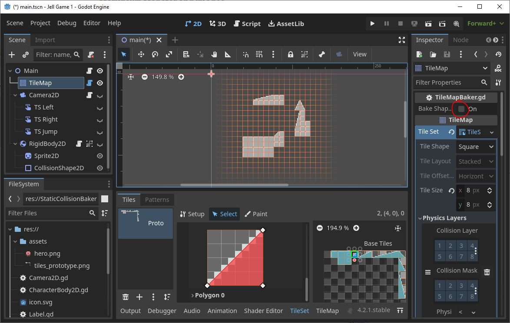
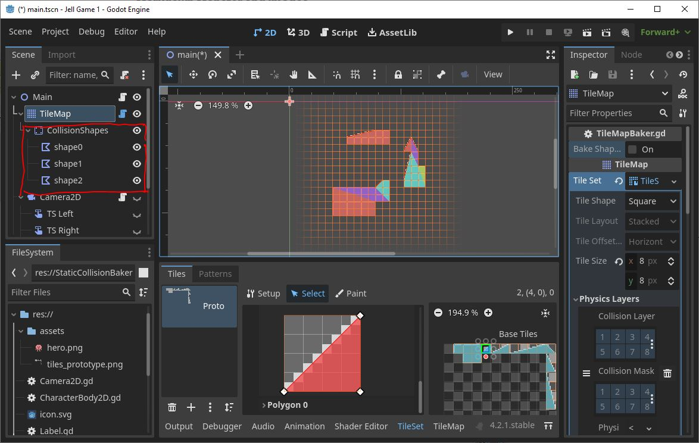
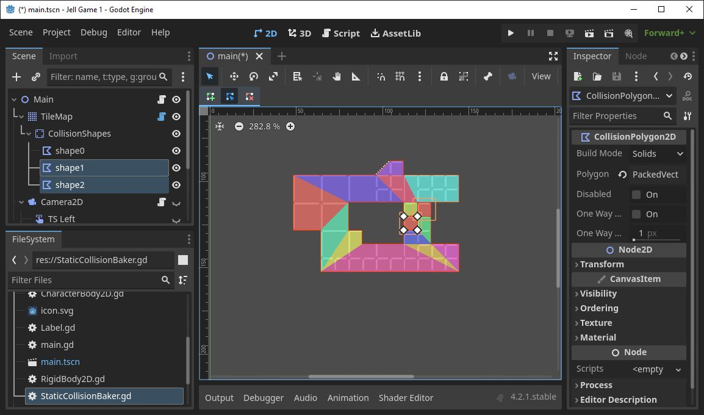
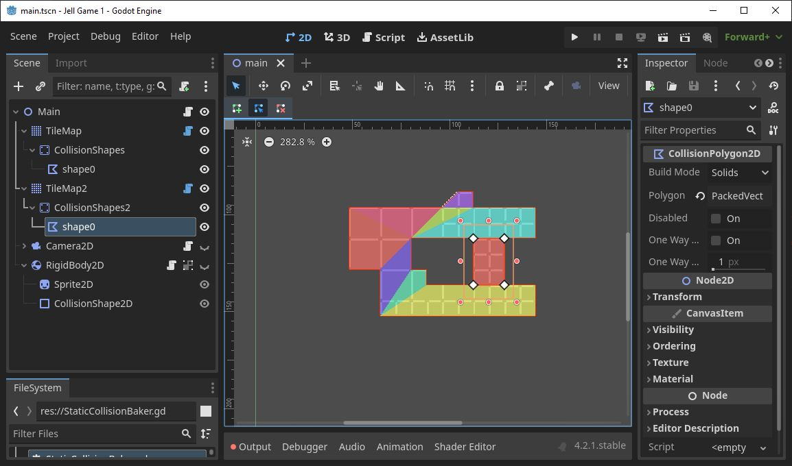

# Godot TileMap Poly Collision Baker

A tool script for Godot TileMap nodes to generate merged contiguous CollisionPolygon2D polygons from the TileMap physics polygons. Made using Godot v4.2.1.

## Getting Started

### Running the Baker
 
* Attach TileMapBaker.gd to a TileMap Node
* Add a physics layer and draw collision polygons for each tile. You can uncheck the collision layer and collision mask for the physics layer, as the polygon will be used to generate CollisionPolygon2D nodes
* Add your tiles
* Click 'Bake Shapes' in the script

* Script will add a StaticBody2D node as a child of the TileMap node, with CollisionPolygon2D nodes as children of that node

* If you change the tilemap after baking, you can hit 'Bake Shapes' again and the script will delete the shapes, and redraw them

### Limitations and Workarounds

* You need to use alternative tiles with their own physics polygons rather than flipping original ones using the TileMap editor shortcuts as of the current Godot version
* Holes: This script uses the Geometry2D class's merge polygon function to combine CollisionPolygon2D nodes. Tile shapes which form holes in polygons will be closed with the unmerged tile polygon, rather than being one polygon

* To control which tile groups get merged, you can use two different TileSet nodes, each with the TileMapBaker.gd script attached

## License

This project is licensed under the MIT License - see the LICENSE.md file for details

## Acknowledgments

Generally referenced from:

* https://github.com/popcar2/GodotTilemapBaker
* https://gist.github.com/afk-mario/15b5855ccce145516d1b458acfe29a28