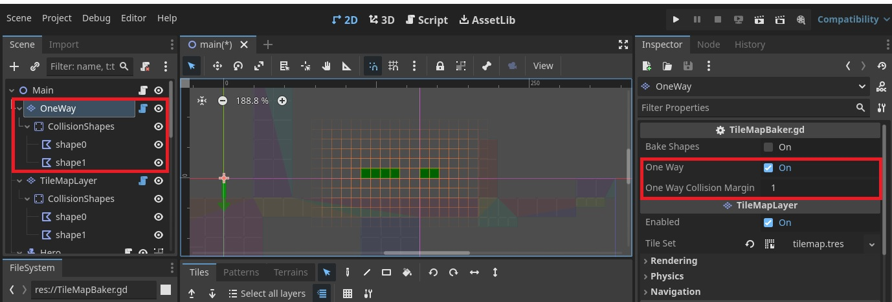

# Godot TileMap Poly Collision Baker

A tool script for Godot TileMapLayer nodes to generate merged contiguous CollisionPolygon2D polygons from the TileMapLayer physics polygons. Currently tested on Godot v4.3 rc3.

### Changelog

**8-11-2024**
* Updated to use Godot 4.3's new TileMapLayer nodes.
* Added setting for 'One Way Collision' and margin.

## Getting Started

### Running the Baker
 
* Attach TileMapBaker.gd to a TileMapLayer Node
* Add a physics layer and draw collision polygons for each tile. You can uncheck the collision layer and collision mask for the physics layer, as the tile polygon will be used to generate CollisionPolygon2D nodes
* Paint your tiles
* Click 'Bake Shapes' in the script

* The script will add a StaticBody2D node as a child of the TileMapLayer node, with the merged contiguous CollisionPolygon2D nodes as children of that node

* If you make any changes to the TileMapLayer after baking, you can hit 'Bake Shapes' again and the script will delete the shapes, and regenerate them
* To use One Way Collision, use a separate TileMapLayer with TileMapBaker.gd attached. Enable 'One Way' and set the 'One Way Collision Margin' and click 'Bake Shapes'.

* All shapes generated with 'One Way' enabled in the TileMapBaker.gd script will be set for one way collision with the margin entered.

### Limitations and Workarounds

* You need to use alternative tiles with their own physics polygons rather than flipping original ones using the TileMapLayer editor shortcuts as of the current Godot version
* Holes: This script uses the Geometry2D class's merge polygon function to combine CollisionPolygon2D nodes. Trying to merge tiles which result in polygons with holes will have unexpected results.

* To control which tile groups get merged, you can use separate TileMapLayers, each with the TileMapBaker.gd script attached

## License

This project is licensed under the MIT License - see the LICENSE.md file for details

## Acknowledgments

Generally referenced from:

* https://github.com/popcar2/GodotTilemapBaker
* https://gist.github.com/afk-mario/15b5855ccce145516d1b458acfe29a28
